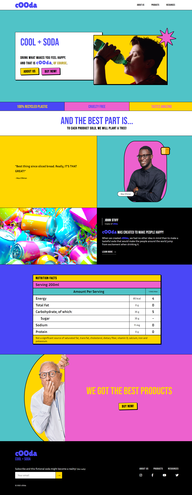
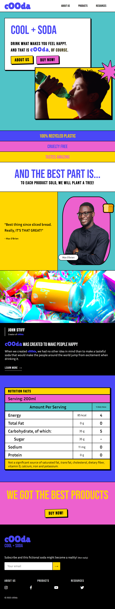
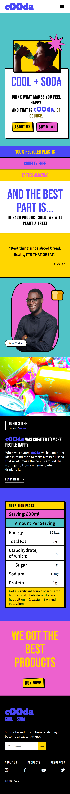

# cOOda


### [Live Demo](https://luhmeiy.github.io/cOOda-Neubrutalist-Website/)

## Table of Contents

- [📑 About](#-about)
- [📷 Screenshots](#-screenshots)
    - [💻 Desktop](#-desktop)
    - [Tablet](#tablet)
    - [📱 Phone](#-phone)
- [📚 What I Learned](#-what-i-learned)
- [🤔 How To Use](#-how-to-use)
- [📝 How To Edit](#-how-to-edit)

## 📑 About

cOOda is a website prototype inspired by the Neubrutalist design trend.

cOOda is a website about the best fictional soda that has ever existed. It can literally make you feel happy for hours on end (allegedly). It also has a probably dangerous level of sugar. "Probably".

## 📷 Screenshots

### 💻 Desktop


### Tablet


### 📱 Phone


## 📚 What I Learned

This project was a little design experimentation with the neobrutalist style. I wasn't very sure if I could pull it off at first, but it worked out quite nicely.

It was interesting to design a website from the ground up. I learned a lot about how to position elements, whitespacing, typography, color theory and much more. It was also my first time working with Firebase and, even though it played a very small role in the project, I loved it and plan on using it in the future.

## 🤔 How To Use
```
- Clone this repository:
$ git clone https://github.com/Luhmeiy/cOOda-Neubrutalist-Website cOOda

- Enter the directory:
$ cd cOOda

- Install dependencies:
$ npm run install
```

You can run the website by opening index.html.

## 📝 How To Edit
```
- Start live server:
$ npm start

- This command will update your css file everytime you save a sass file.

- When you have finished your edits:
$ npm run build:css

- This command will compile, prefix and compress the sass files into a single css file.
```

---

<div align="center">

[](https://www.linkedin.com/in/luhmeiy/)
[](https://instagram.com/luhmeiy)

</div>
